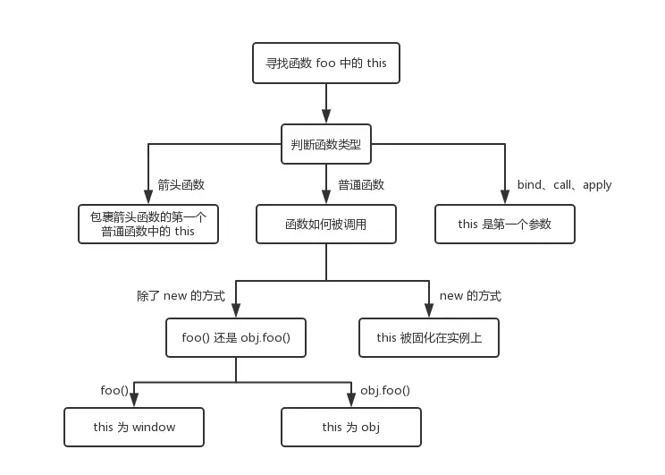

## 神秘的this

对于 `Java`、`PHP` 这类*标准语言*，`this` 表示当前类的实例化对象，它不能够在类的方法外使用，简单直接，因此并不会让人产生困惑。

但在 `JavaScript` 中情况就比较复杂了：**`this` 指向当前函数调用的执行上下文(`context`)**，有四种函数调用类型：

- 函数直接调用(`function invocation`：`alert('Hello World!')`
- 方法调用(`method invocation`：`console.log('Hello World!')`
- 构造函数调用(`constructor invocation`：`new RegExp('\\d')`
- 间接调用(`indirect invocation`：`alert.call(undefined, 'Hello World!')`

每种调用方式都产生了各自不同的上下文，因此 `this` 有时候可能并不是我们所期待的。


此外，严格模式（`strict mode`）也会影响到 `this` 的指向。

> 弄清 `this` 指向的关键就是对上边函数调用类型有一个清楚的判断

下边会详细介绍每一种调用类型的区别，以及它们是怎么影响 `this` 指向的，同时会举例说明一些容易判断出错的陷阱。

## 1. 函数直接调用(function invocation)

*定义：一个可以解析成函数对象的表达式，紧跟着左括号，然后是逗号分割的参数，最后是右括号。例如 `parseInt('18')`。*

下边看一个简单的函数直接调用的例子：

```js
function hello(name) {
  return 'Hello ' + name + '!';
}
// Function invocation
const message = hello('World');
```

`hello('World')` 就是一个函数直接调用：`hello`可以解析成一个函数对象，紧跟着是用括号括起来的 `World` 参数。

函数直接调用和通过对象属性 `obj.myFunc()` 是不同的，它叫做方法调用 `method invocation`（后边介绍的第 `2` 种类型）。比如 `[1,5].join(',')` 这种不是一个函数直接调用，而是方法调用。**这两种是最容易混淆的，需要特别注意**。

此外，一个 `IIFE(immediately-invoked function expression)` 也属于函数直接调用。

```js
// IIFE
const message = (function(name) {
  return 'Hello ' + name + '!';
})('World');
```

第一对括号内的 `(function(name) {...})` 是一个可以解析成函数对象的表达式，接下来的一对括号中 `('World')` 括的就是参数列表。

## 1.1 函数直接调用中的 `this` 指向

首先需要知道全局对象是什么，不同执行环境中全局对象不同。在浏览器中全局对象是 `window`，`Node.js` 中的全局对象是 `global`。下边主要以浏览器的执行环境来分析。


在「函数直接调用」中，执行上下文就是全局对象，也就是 `this` 的指向。

让我们看下边的例子：

```js
function sum(a, b) {
  console.log(this === window); // => true
  this.myNumber = 20; // add 'myNumber' property to global object
  return a + b;
}
// sum() is invoked as a function
// this in sum() is a global object (window)
sum(15, 16);     // => 31
window.myNumber; // => 20
```

当调用 `sum(15, 16)` 的时候，`JavaScript` 会自动将 `this` 指向全局对象（浏览器中的 `window`）。

当 `this` 在函数外的顶级作用域中使用的时候，同样也是指向全局对象的：

```js
console.log(this === window); // => true
this.myString = 'Hello World!';
console.log(window.myString); // => 'Hello World!'
```

在 `html` 中的 `script` 中也是一样的。

```html
<!-- In an html file -->
<script type="text/javascript">
 console.log(this === window); // => true
</script>
```

## 1.2 函数直接调用中的 `this` 指向（严格模式）

> 严格模式下，函数直接调用中的 `this` 是 `undefined`。

严格模式在[ECMAScript 5.1](https://link.zhihu.com/?target=http%3A//www.ecma-international.org/ecma-262/5.1/%23sec-10.1.1) 出现，对 `js` 一些语法进行了限制，可以提供一个更加安全、健壮的错误检查机制。

在函数体顶部加入 `'user strict'` 即可使用严格模式。

严格模式会影响当前上下文环境（`context`)，在函数直接调用场景中，`this` 会变为 `undefind`，而不是上边介绍的全局对象。


下边举一个使用严格模式的例子：

```js
function multiply(a, b) {
  'use strict'; // enable the strict mode
  console.log(this === undefined); // => true
  return a * b;
}
// multiply() function invocation with strict mode enabled
// this in multiply() is undefined
multiply(2, 5); // => 10
```

当使用严格模式调用 `multiply(2, 5)` 的时候，`this` 就是 `undefined`。

严格模式不仅对当前作用域有效，它内部的作用域（当前作用域内定义的函数内）也会是严格模式。

```js
function execute() {
  'use strict';
  function concat(str1, str2) {
    // the strict mode is enabled too
    console.log(this === undefined); // => true
    return str1 + str2;
  }
  console.log(this === undefined); // => true
  // concat() is invoked as a function in strict mode
  // this in concat() is undefined
  concat('Hello', ' World!'); // => "Hello World!"
}
execute();
```

上边的代码中，`use strict` 是写在 `execute` 函数体的头部，函数内部的 `this` 会是 `undefined`。同时，因为 `concat` 是定义在 `execute` 内部，它也会继承严格模式。因此 `concat('Hello', ' World!')` 的调用，其内部的 `this` 也会指向 `undefined`。

一个单独 `js` 文件可能包含多个作用域，因此不同的作用域可能分别处于非严格模式和严格模式。

```js
function nonStrictSum(a, b) {
  // non-strict mode
  console.log(this === window); // => true
  return a + b;
}
function strictSum(a, b) {
  'use strict';
  // strict mode is enabled
  console.log(this === undefined); // => true
  return a + b;
}
// nonStrictSum() is invoked as a function in non-strict mode
// this in nonStrictSum() is the window object
nonStrictSum(5, 6); // => 11
// strictSum() is invoked as a function in strict mode
// this in strictSum() is undefined
strictSum(8, 12); // => 20
```

## 1.3 陷阱：内部函数的 `this` 指向

⚠️一个很普遍的陷阱：对于函数直接调用，可能会认为如果是函数内部定义的函数，它的 `this` 会指向外部函数的上下文。

要始终记得，内部函数的 `this` 指向（除了箭头函数）只和它的调用类型相关（也就是本文介绍的几种类型），而不是它所在函数的上下文。

为了使 `this` 变成我们所期待的值，我们可以通过间接调用来实现（比如 `.call()` 或者 `.apply()`，下边第 `4` 节会介绍），或者创造一个绑定函数（使用 `.bind()`，下边第 `5` 节会介绍）。

看一下下边两数相加的例子：

```js
const numbers = {
  numberA: 5,
  numberB: 10,
  sum: function() {
    console.log(this === numbers); // => true
    function calculate() {
      // this is window or undefined in strict mode
      console.log(this === numbers); // => false
      return this.numberA + this.numberB;
    }
    return calculate();
  }
};
numbers.sum(); // => NaN or throws TypeError in strict mode
```

⚠️ `numbers.sum()` 属于对象的一个方法调用，下一小节会讲。从代码分析，这里 `calculate()` 的结果其实就是 `numbers.sum()` 的结果 。因为 `calculate` 函数定义在 `sum` 中，`sum` 是 `numbers` 对象的属性，因此当调用 `numbers.sum()`， 我们会觉得 `calculate` 中的 `this` 也指向 `numbers` 对象。

重点来了，由于 `calculate()` 属于我们这一小节中讲的「函数直接调用」的类型，而不是下一小节的「方法调用」。所以 `calculate` 中的 `this` 指向全局对象 `window`，或者严格模式下的 `undefined`。即使在 `numbers.sum()` 中的 `this` 指向当前对象 `numbers`，但是它并不会影响 `calculate` 中的 `this`。

因此 `numbers.sum()` 的调用结果是 `NaN` （或者在严格模式下抛出一个错误 `TypeError: Cannot read property 'numberA' of undefined`)。而不是我们所期待的 `5 + 10 = 15` 。

为了解决这个问题，`calculate()` 函数必须拥有和 `numbers.sum()` 相同的 `this` 指向，这样在 `calculate` 中才能访问到 `this.numberA` 和 `this.numberB`。

一种解决方法就是使用 `call` 方法来手动改变 `calculate()` 中的 `this` 指向。（第 `4` 节的时候会介绍「间接调用」这种类型）

```js
const numbers = {
  numberA: 5,
  numberB: 10,
  sum: function() {
    console.log(this === numbers); // => true
    function calculate() {
      console.log(this === numbers); // => true
      return this.numberA + this.numberB;
    }
    // use .call() method to modify the context
    return calculate.call(this);
  }
};
numbers.sum(); // => 15
```

`calculate.call(this)` 会正常执行 `calculate()`函数，同时会将它的执行上下文变为所传入的第一个参数。

现在 `this.numberA + this.numberB` 就相当于 `number.numberA + numbers.numberB` 了，所以结果就是 `5 + 10 = 15` 了。

另外一种解决方法看起来会更好，那就是通过箭头函数。

```js
const numbers = {
  numberA: 5,
  numberB: 10,
  sum: function() {
    console.log(this === numbers); // => true
    const calculate = () => {
      console.log(this === numbers); // => true
      return this.numberA + this.numberB;
    }
    return calculate();
  }
};
numbers.sum(); // => 15
```

箭头函数中的 `this` 会指向它所定义的地方，这里就是 `numbers.sum` 中的 `this`，会在第 `6` 讲中继续讲箭头函数。

## 2 方法调用

对象中的某个属性如果是函数，我们称其为方法。例如：

```js
const myObject = {
  // helloMethod is a method
  helloMethod: function() {
    return 'Hello World!';
  }
};
const message = myObject.helloMethod();
```

`helloMethod` 是 `myObject` 的一个方法。使用属性访问器 `myObject.helloMethod` 可以调用这个方法。

*方法调用定义：通过属性访问器得到一个函数对象，紧跟着左括号，然后是逗号分割的参数，最后是右括号。例如上边的例子 `myObject.helloMethod()`。*

更多其他的例子：`[1, 2].join(',')` or `/\s/.test('beautiful world')`。

再强调一遍，区分上一节介绍的「函数直接调用」类型和这一节介绍的「方法调用」非常重要。

```js
const words = ['Hello', 'World'];
words.join(', ');   // method invocation
const obj = {
  myMethod() {
    return new Date().toString();
  }
};
obj.myMethod();     // method invocation
const func = obj.myMethod;
func();             // function invocation
parseFloat('16.6'); // function invocation
isNaN(0);           // function invocation
```

## 2.1 方法调用中的 `this` 指向

> 在方法调用中，`this` 指向拥有这个方法的对象。

当我们调用对象中的一个方法时，`this` 指向拥有这个方法的对象。


我们来看一个增加数字的例子。

```js
const calc = {
  num: 0,
  increment() {
    console.log(this === calc); // => true
    this.num += 1;
    return this.num;
  }
};
// method invocation. this is calc
calc.increment(); // => 1
calc.increment(); // => 2
```

通过方法调用的方式 `calc.increment()`，使得 `increment` 内部的 `this` 指向了 `cals` 对象，因此 `this.num` 会成功增加 `num` 属性的值。

让我们再看一个例子。对象通过原型继承一个方法，当方法通过属性访问器调用的时候，所继承的这个方法中的 `this` 也是指向对象本身：

```js
const myDog = Object.create({
  sayName() {
    console.log(this === myDog); // => true
    return this.name;
  }
});
myDog.name = 'Milo';
// method invocation. this is myDog
myDog.sayName(); // => 'Milo'
```

上边代码中，`Object.create()` 返回一个新对象 `myDog`，并且将它的原型对象指向第一个参数。`myDog` 对象会继承 `SayName` 方法。

在 `ECMAScript 2015` 中的 `class` 关键词里，方法调用中的上下文，也就是 `this` 同样指向它本身。

```js
class Planet {
  constructor(name) {
    this.name = name;
  }
  getName() {
    console.log(this === earth); // => true
    return this.name;
  }
}
const earth = new Planet('Earth');
// method invocation. the context is earth
earth.getName(); // => 'Earth'
```

## 2.2 陷阱：将对象中的方法抽离

⚠️ 我们可以将对象中的方法提取出来做为一个独立的变量 `const alone = myObj.myMethod`。当调用函数的时候 `alone()`，由于它是从原来对象拆出来的，所以可能会认为函数中的 `this` 会指向 `myObject`。

然而，如果一个方法没有经过对象的属性访问器调用，那它就属于第一节介绍的「函数直接调用」类型，这里的 `this` 会指向全局对象 `window` 或者严格模式下的 `undefined`。

我们可以通过 `bind` 方法来修正这种情况，`const alone = myObj.myMethod.bind(myObj)`。

再看一个例子，我们通过构造函数 `Pet` 得到一个实例化对象 `myCat`。然后通过 `setTimeout()` 在一秒后打印对象内部的信息。

```js
function Pet(type, legs) {
  this.type = type;
  this.legs = legs;
  this.logInfo = function() {
    console.log(this === myCat); // => false
    console.log(`The ${this.type} has ${this.legs} legs`);
  }
}
const myCat = new Pet('Cat', 4);
// logs "The undefined has undefined legs"
// or throws a TypeError in strict mode
setTimeout(myCat.logInfo, 1000);
```

⚠️ 你也许会认为 `setTimeout(myCat.logInfo, 1000)` 将会调用 `myCat.logInfo()`，然后打印 `myCat` 的 `type` 和 `legs`。

但事与愿违，方法是从对象中抽离然后做为了一个参数，`setTimout(myCat.logInfo)` 等价于下边的代码。

```js
setTimeout(myCat.logInfo);
// is equivalent to:
const extractedLogInfo = myCat.logInfo;
setTimeout(extractedLogInfo);
```

当调用提取的 `logInfo` 的时候其实属于「函数直接调用」类型，所以 `this` 会指向全局对象 `window` 或者严格模式下的`undefined` ，而不会是 `myCat` 对象。因此 `logInfo` 函数并不能正确的打印相关的信息。

同样的，这种情况下我们可以使用 `bind` 来修复。

```js
function Pet(type, legs) {
  this.type = type;
  this.legs = legs;
  this.logInfo = function() {
    console.log(this === myCat); // => true
    console.log(`The ${this.type} has ${this.legs} legs`);
  };
}
const myCat = new Pet('Cat', 4);
// Create a bound function
const boundLogInfo = myCat.logInfo.bind(myCat);
// logs "The Cat has 4 legs"
setTimeout(boundLogInfo, 1000);
```

`myCat.logInfo.bind(myCat)` 会返回一个新的函数，会像 `logInfo` 那样执行，同时 `this` 会指向 `myCat`，即使我们是通过 「函数直接调用」。

当然，我们也可以使用箭头函数。

```js
function Pet(type, legs) {
  this.type = type;
  this.legs = legs;
  this.logInfo = () => {
    console.log(this === myCat); // => true
    console.log(`The ${this.type} has ${this.legs} legs`);
  };
}
const myCat = new Pet('Cat', 4);
// logs "The Cat has 4 legs"
setTimeout(myCat.logInfo, 1000);
```

如果你使用了 `class`，为了防止上边的问题，我们可以将箭头函数做为一个类属性。

```js
class Pet {
  constructor(type, legs) {
    this.type = type;
    this.legs = legs;
  }
  logInfo = () => {
    console.log(this === myCat); // => true
    console.log(`The ${this.type} has ${this.legs} legs`);
  }
}
const myCat = new Pet('Cat', 4);
// logs "The Cat has 4 legs"
setTimeout(myCat.logInfo, 1000);
```

## 3. 构造函数调用

*定义：以 `new` 关键词开头，接着是一个可以解析成函数对象的表达式，紧跟着左括号，然后是逗号分割的参数，最后是右括号。例如 `new Pet('cat', 4)`、 `new RegExp('\\d')`。*

让我们定义 `Country` 函数，然后通过构造函数的方式调用：

```js
function Country(name, traveled) {
  this.name = name ? name : 'United Kingdom';
  this.traveled = Boolean(traveled); // transform to a boolean
}
Country.prototype.travel = function() {
  this.traveled = true;
};
// Constructor invocation
const france = new Country('France', false);
// Constructor invocation
const unitedKingdom = new Country;
france.travel(); // Travel to France
```

`new Country('France', false)` 这种调用方式会创建一个新对象，它的 `name` 属性是 `France`。

如果构造函数不需要传递参数，我们可以省略到它的括号，`new Country`。

从 `ECMAScript 2015` 开始，`Js` 允许我们通过 `class` 关键词来定义构造函数。

```js
class City {
  constructor(name, traveled) {
    this.name = name;
    this.traveled = false;
  }
  travel() {
    this.traveled = true;
  }
}
// Constructor invocation
const paris = new City('Paris', false);
paris.travel();
```

`new City('Paris')` 就是「构造函数调用」类型。创建的对象通过类中一个特殊的方法 `constructor` 来初始化，其中 `this` 就指向当前创建的新对象。

如果属性访问器 `myObject.myFunction` 通过 `new` 调用，那么这种就属于「构造函数调用」，而不再是「方法调用」。

举个例子，`new myObject.myFunction()`：相当于先通过属性访问器抽离函数 `extractedFunction = myObject.myFunction`，然后通过构造函数的方法创建一个新对象 `new extractedFunction()`。

## 3.1 构造函数调用中的 `this` 指向

> this 指向通过构造函数创建的新对象

构造函数的上下文是新创建的对象。构造函数通过传来的参数进行初始化对象，设置初始值、绑定事件监听函数等等。


看一下下边的例子：

```js
function Foo () {
  // this is fooInstance
  this.property = 'Default Value';
}
// Constructor invocation
const fooInstance = new Foo();
fooInstance.property; // => 'Default Value'
```

`new Foo()` 通过构造函数的方式调用，其中的 `this` 就指向当前的对象 `fooInstance`，`this.property` 被初始化了一个值。

同样的情况在 `class` 中也是一样的，只不过初始化发生在 `constructor` 中。

```js
class Bar {
  constructor() {
    // this is barInstance
    this.property = 'Default Value';
  }
}
// Constructor invocation
const barInstance = new Bar();
barInstance.property; // => 'Default Value'
```

## 3.2 陷阱：忘记使用 `new`

有些 `JavaScript` 的函数除了可以通过构造函数创建对象，也可以通过函数直接调用的方式，比如 `RegExp`。

```js
const reg1 = new RegExp('\\w+');
const reg2 = RegExp('\\w+');
reg1 instanceof RegExp; // => true
reg2 instanceof RegExp; // => true
reg1.source === reg2.source; // => true
```

执行 `new RegExp('\\w+')` 和 `RegExp('\\w+')` ，`Js` 创建了等价的正则表达式对象。

⚠️ 通过函数直接调用的方式去创建对象可能会有潜在风险，因为如果不使用 `new` 关键词 一些构造函数可能会忽略掉属性的初始化。

看一下下边的例子：

```js
function Vehicle(type, wheelsCount) {
  this.type = type;
  this.wheelsCount = wheelsCount;
  return this;
}
// Function invocation
const car = Vehicle('Car', 4);
car.type; // => 'Car'
car.wheelsCount // => 4
car === window // => true
```

`Vehicle` 在上下文对象中会初始化 `type` 和 `wheelsCount` 属性。当执行 `Vehicle('Car', 4)` 的时候将 `car` 对象返回，拥有正确的属性 `car.type` 和 `car.wheelCount` 。

上边看起来就是按照我们需要的样子进行的初始化，打印出来的值也都是正确的。

然而，`Vehicle('Car', 4)` 属于「函数直接调用类型」，因此它的 `this` 指向 `window`。所以，上边返回的 `car` 其实是 `window` 对象，将 `type` 和 `wheelCount` 属性都挂在了 `window` 上。

为了确保在使用构造函数的时候加上了 `new` 关键词，我们可以做一些改进：

```js
function Vehicle(type, wheelsCount) {
  if (!(this instanceof Vehicle)) {
    throw Error('Error: Incorrect invocation');
  }
  this.type = type;
  this.wheelsCount = wheelsCount;
  return this;
}
// Constructor invocation
const car = new Vehicle('Car', 4);
car.type               // => 'Car'
car.wheelsCount        // => 4
car instanceof Vehicle // => true
// Function invocation. Throws an error.
const brokenCar = Vehicle('Broken Car', 3);
```

通过判断 `this instanceof Vehicle` ，我们就可以保证当前的执行上下文环境是当前创建的新对象，保证 `this` 指向正确。

## 4. 间接调用

> `this` 指向 `.call()` 或者 `.apply()` 所传的第一个参数


下边看一个例子：

```js
const rabbit = { name: 'White Rabbit' };
function concatName(string) {
  console.log(this === rabbit); // => true
  return string + this.name;
}
// Indirect invocations
concatName.call(rabbit, 'Hello ');  // => 'Hello White Rabbit'
concatName.apply(rabbit, ['Bye ']); // => 'Bye White Rabbit'
```

间接调用方式对于修正函数的上下文执行环境很有用，例如上边我们介绍过的很多例子，当通过「函数直接调用」方式时，`this` 会指向 `window` 或者严格模式下的 `undefined`。此时我们就可以通过 `.call()` 或者 `.apply()` 将 `this` 指向我们需要的对象。

另一个经典的例子就是 `ES5` 中调用父类的构造函数。

```js
function Runner(name) {
  console.log(this instanceof Rabbit); // => true
  this.name = name;
}
function Rabbit(name, countLegs) {
  console.log(this instanceof Rabbit); // => true
  // Indirect invocation. Call parent constructor.
  Runner.call(this, name);
  this.countLegs = countLegs;
}
const myRabbit = new Rabbit('White Rabbit', 4);
myRabbit; // { name: 'White Rabbit', countLegs: 4 }
```

在 `Rabbit` 中调用 `Runner.call(this, name)` 使得在父函数中的 `this` 是当前子类相应的对象。

## 5. 绑定函数

*定义：执行上下文或者参数被绑定了具体值的函数。可以通过 `.bind()` 进行创建。原始函数和新的函数共享了相同的代码和作用域，但是执行的时候拥有不同的执行上下文和参数。*

`myFunc.bind(thisArg[, arg1, arg2, ...)` 的第一个参数 `thisArg` 作为执行上下文，后边的 `arg1, arg2, ...` 是要预置的参数值。

看一下下边的例子：

```js
function multiply(number) {
  'use strict';
  return this * number;
}
// create a bound function with context
const double = multiply.bind(2);
// invoke the bound function
double(3); // => 6
double(10); // => 20
```

`multiply.bind(2)` 返回了一个新函数 `double`，相当于 `2.multiply`。

`.bind()` 和 `.apply()` 和 `.call()` 最大的不同就是，`.bind()` 是返回一个拥有预设的 `this` 和参数的新函数，后边还需要被调用才会执行。而 `.apply()` 和 `.call()` 是调用的时候就执行了。

## 5.1 绑定函数中的 `this` 指向

> 当执行一个绑定函数的时候，`this` 指向创建绑定函数 `myFunc.bind(thisArg)` 时候传的第一个参数。

`.bind()` 函数的作用就是创建一个新的函数，我们需要将要绑定的上下文环境作为第一个参数传给它。


让我们看一下例子。

```js
const numbers = {
  array: [3, 5, 10],
  getNumbers() {
    return this.array;
  }
};
// Create a bound function
const boundGetNumbers = numbers.getNumbers.bind(numbers);
boundGetNumbers(); // => [3, 5, 10]
// Extract method from object
const simpleGetNumbers = numbers.getNumbers;
simpleGetNumbers(); // => undefined or throws an error in strict mode
```

通过 `bind` 绑定后返回的 `boundGetNumbers` 函数中 `this` 指向了传入的 `numbers`，因此当执行的时候返回的是传入的数组。

如果是简单的将 `numbers.getNumbers` 抽离出来作为一个新函数 `simpleGetNumbers` ，此时属于「函数直接调用类型」，因此 `this` 指向 `window` ，执行的时候就不是我们所期待的了。

## 5.2 牢固的上下文绑定

`.bind()` 会创造一个永久的上下文绑定，其中的 `this` 指向不会再发生改变。我们无法再通过 `.call()`、`.apply()` 或者 `.bind()` 来改变 `this` 指向。

唯一能够改变的方式就是通过构造函数调用，但平常开发中不建议采用这种调用方式。

```js
function getThis() {
  'use strict';
  return this;
}
const one = getThis.bind(1);
one();         // => 1
one.call(2);   // => 1
one.apply(2);  // => 1
one.bind(2)(); // => 1
new one();     // => Object
```

可以看一下上边的结果，只有 `new one()` 中的 `this` 指向来一个新对象，而其他方式中的 `this` 都是最初绑定的 `1`。

## 6 箭头函数

*定义：箭头函数是定义函数的一种简写形式，并且它绑定的上下文是词法作用域确定的（简单理解就是 `this` 指向它定义位置的上下文）。*

```js
const hello = (name) => {
  return 'Hello ' + name;
};
hello('World'); // => 'Hello World'
// Keep only even numbers
[1, 2, 5, 6].filter(item => item % 2 === 0); // => [2, 6]
```

## 6.1 箭头函数中的 `this`

> `this` 指向定义箭头函数位置的上下文。

箭头函数不会创建自己的执行上下文，而是将 `this` 指向外部函数已经创建的执行上下文。


看一下例子：

```js
class Point {
  constructor(x, y) {
    this.x = x;
    this.y = y;
  }
  log() {
    console.log(this === myPoint); // => true
    setTimeout(() => {
      console.log(this === myPoint);      // => true
      console.log(this.x + ':' + this.y); // => '95:165'
    }, 1000);
  }
}
const myPoint = new Point(95, 165);
myPoint.log();
```

`setTimeout()` 调用箭头函数的时候，它的 `this` 会指向外部的执行上下文，也就是 `myPoint`。

如果箭头函数是定义在顶级作用域内（也就是函数外），`this` 将指向浏览器的全局对象 `window`，严格模式下也是一样的。

```js
const getContext = () => {
 console.log(this === window); // => true
 return this;
};
console.log(getContext() === window); // => true
```

箭头函数和 `bind` 函数一样，一旦确定了 `this` 指向就无法再改变了。

```js
const numbers = [1, 2];
(function() { 
  const get = () => {
    console.log(this === numbers); // => true
    return this;
  };

  console.log(this === numbers); // => true
  get(); // => [1, 2]

  // Try to change arrow function context manually
  get.call([0]);  // => [1, 2]
  get.apply([0]); // => [1, 2]

  get.bind([0])(); // => [1, 2]
}).call(numbers);
```

不论我们如何调用箭头函数，最终输出的依旧是最开始的绑定的 `[1, 2]`。

那构造函数可以改变 `this` 指向吗？不会的，调用箭头函数作为构造函数会抛出错误，`TypeError: get is not a constructor`。

## 6.2 陷阱：用箭头函数作为一个对象方法

⚠️ 既然箭头函数这么简洁方便，你可能想将对象的一个方法来用箭头函数声明，`(param) => {...}` 来代替 `function(param) {..}`。

看一下下边的例子：

```js
function Period (hours, minutes) { 
  this.hours = hours;
  this.minutes = minutes;
}
Period.prototype.format = () => {
  console.log(this === window); // => true
  return this.hours + ' hours and ' + this.minutes + ' minutes';
};
const walkPeriod = new Period(2, 30);
walkPeriod.format(); // => 'undefined hours and undefined minutes'
```

因为 `format` 是一个箭头函数，所以它的 `this` 指向它定义地方的执行上下文，也就是这里的 `window`。

即使 `format` 是通过「方法调用」的形式 `walkPeriod.format()`，函数中的 `this` 依旧是指向最初定义时候的 `window` ，而不会改变成当前对象。

因此我们需要用 `function` 来定义函数。

```js
function Period (hours, minutes) {
  this.hours = hours;
  this.minutes = minutes;
}
Period.prototype.format = function() {
  console.log(this === walkPeriod); // => true
  return this.hours + ' hours and ' + this.minutes + ' minutes';
};
const walkPeriod = new Period(2, 30);
walkPeriod.format(); // => '2 hours and 30 minutes'
```

`walkPeriod.format()` 属于第 `2` 节介绍「方法调用」类型，所以 `this` 会指向调用它的对象 `walkPeriod`，最终也会打印正确的结果。

## 总结

通过上边的分析，我们发现影响 `this` 指向的其实是函数的调用类型，因此从现在起不要再问自己：

> 这个 `this` 是怎么得到的？

而是问自己：

> 这个函数是属于哪种调用类型？
> 「函数直接调用」？「方法调用」？「构造函数调用」？「间接调用」？

如果是绑定函数就问自己：

> 这个函数 `bind` 的时候传的什么参数？

如果是箭头函数就问自己：

> 箭头函数是在哪里定义的，它外部的执行上下文是什么？

通过上边的思路，可以使你不再对 `this` 感到头疼！



