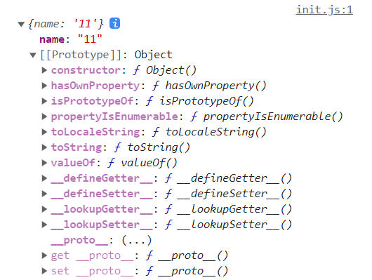
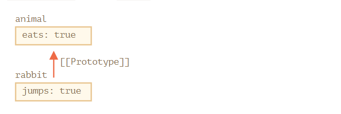

### 原型[[Prototype]]

JavaScript 中 对象处理 明面上 定义的熟悉，还有个特殊的隐藏属性`[[Prototype]]`，它要么为 `null`，要么为 对另一个对象的引用，该对象被称为**原型**



### [[Prototype]]设置方式

#### 使用特殊的名字 `_proto_`

例如

```js
let animal = {
  eats: true
};
let rabbit = {
  jumps: true
};

rabbit.__proto__ = animal; // 设置 rabbit.[[Prototype]] = animal
```

现在，我们要从`rabbit`读取一个它没有的属性， JavaScript 会自动从 `animal`中获取

```js
let animal = {
  eats: true
};
let rabbit = {
  jumps: true
};

rabbit.__proto__ = animal; // (*)

// 现在这两个属性我们都能在 rabbit 中找到：
alert( rabbit.eats ); // true (**)
alert( rabbit.jumps ); // true
```

我们可以这样理解

1. 在 `(*)`这行中，我们设置了 `animal` 为 `rabbit` 的原型
2. 当 alert 试图读取 `rabbit.eats`  `(**)`时，因为它不存在 `rabbit` 中，所以 JavaScript会顺着 `[[Prototype]]`引用，在 `animal` 中查找（自下而上）
   

在这里，我们可以说：

- animal 是 rabbit 的原型
- 或者说， rabbit 对的 原型是从 animal 继承而来的

> 因此，如果 animal 有许多的属性和方法，那么他们自动地变为 在 rabbit 中可用，这种属性被称为 **继承**

### 原型说明

- 由原型组构成的叫原型链

- 原型链可很长，通过 `_proto_`可以设置原型链，`object`默认原型链是 Object 对象
- 原型链设置不能形成闭环，否则 JavaScript 会抛出错误
- `_proto_`的值可以是对象 ，也可以是 `null`，其他的属性会被忽略
- 当然，只能有一个 `[[Prototype]]`，一个对象不能从其他两个对象获得继承

### 写入不使用原型

原型仅限于读取属性

对于写入/删除操作 可以直接在对象上进行

<u>如下示例</u>，将为 rabbit 分配自己的 walk 函数

```js
let animal = {
  eats: true,
  walk() {
    /* rabbit 不会使用此方法 */
  }
};

let rabbit = {
  __proto__: animal
};

rabbit.walk = function() {
  alert("Rabbit! Bounce-bounce!");
};

rabbit.walk(); // Rabbit! Bounce-bounce!
```

但也有例外

访问器(accessor)属性， 因为 分配(assignment) 操作是由 setter 函数 处理的，因此 写入此类属性实际上与调用函数相同

### 对象的this属性不受原型的影响

### for... in 循环也会迭代 继承的属性

如

```js
let animal = {
  eats: true
};

let rabbit = {
  jumps: true,
  __proto__: animal
};

// Object.keys 只返回自己的 key
alert(Object.keys(rabbit)); // jumps

// for..in 会遍历自己以及继承的键
for(let prop in rabbit) alert(prop); // jumps，然后是 eats
```

如果我们想排除掉继承的属性， JavaScript 提供了内建方法 obj.hasOwnProperty(key)，用来判断是否是自己的属性，可以过滤掉继承的属性

> 所以，有时候在用插件的时候 写 for in 循环，为什么会带个 obj.hasOwnProperty了

总结

- 在 JavaScript 中，所有的对象都有一个隐藏的 `[[Prototype]]` 属性，它要么是另一个对象，要么就是 `null`。
- 我们可以使用 `obj.__proto__` 访问它（历史遗留下来的 getter/setter，这儿还有其他方法，很快我们就会讲到）。
- 通过 `[[Prototype]]` 引用的对象被称为“原型”。
- 如果我们想要读取 `obj` 的一个属性或者调用一个方法，并且它不存在，那么 JavaScript 就会尝试在原型中查找它。
- 写/删除操作直接在对象上进行，它们不使用原型（假设它是数据属性，不是 setter）。
- 如果我们调用 `obj.method()`，而且 `method` 是从原型中获取的，`this` 仍然会引用 `obj`。因此，方法始终与当前对象一起使用，即使方法是继承的。
- `for..in` 循环在其自身和继承的属性上进行迭代。所有其他的键/值获取方法仅对对象本身起作用。

### 最后插入抄袭地址

[原型理解]: https://zh.javascript.info/prototype-inheritance

