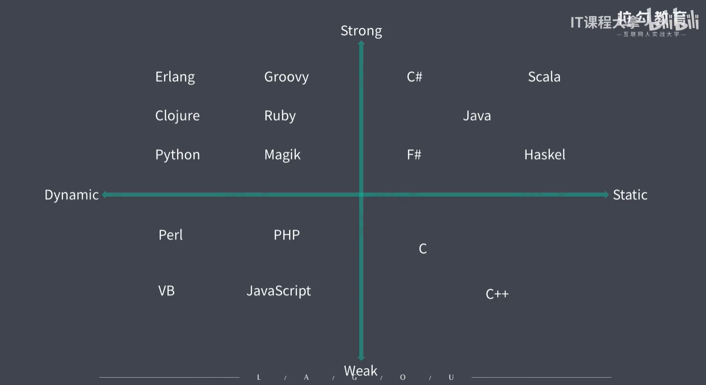

### Ts第一期学习

- 强类型和弱类型的区别（根据类型安全区分）
- 静态类型和动态类型
- ts语言规范和基本使用

------

ts语言层面掀桌子函数的实参类型必须和形参类型相同，

强类型语言不允许由任意的隐式类型的转换

静态类型：一个变量在申明的时候类型就是明确的，申明后类型就不允许被修改

动态类型：在运行阶段才能明确变量类型，变量的类型也能够随时发生改变

### JavaScript 弱语言/动态类型

总结一下，主要是没有类型的语言在运行时因类型传参不同会导致期望的结果不同，从而导致bug产生

### TypeScript 强类型/兼容性好/渐进式JavaScript

优点：

- 编辑时就会报错，提前发现问题
- 代码更智能，编辑更准确
- 重构更有优势
- 减少不必要的类型判断

缺点：

- 相对JavaScript多了很多概念（接口、泛型、枚举）
- 项目周期小时，会增加开发成本
