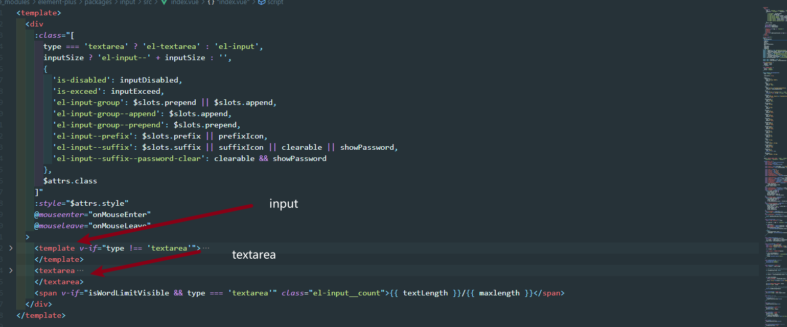

### el-input简要分析



- 最直接的，我们可以发现el-input 基于 原生 `input` 和 `textarea`实现的
- 组件实现了原生组建的所有功能

### $slots 和 $attrs

实话说，对应这两个属性我基本是很少使用到的，在读源码的时候还是明白了怎么了解和使用它。以下代码提供对应解析

```vue
<div
    :class="[
      type === 'textarea' ? 'el-textarea' : 'el-input',
      inputSize ? 'el-input--' + inputSize : '',
      {
        'is-disabled': inputDisabled,
        'is-exceed': inputExceed,
        'el-input-group': $slots.prepend || $slots.append,
        'el-input-group--append': $slots.append,
        'el-input-group--prepend': $slots.prepend,
        'el-input--prefix': $slots.prefix || prefixIcon,
        'el-input--suffix': $slots.suffix || suffixIcon || clearable || showPassword,
        'el-input--suffix--password-clear': clearable && showPassword
      },
      $attrs.class
    ]"
    :style="$attrs.style"
    @mouseenter="onMouseEnter"
    @mouseleave="onMouseLeave"
  >
```

#### $slots

所以我们能够看到 `'el-input-group': $slots.prepend || $slots.append`这样的代码，不难理解他的意思

- 作为子组件，使用`$slots`能拿到父组件 定义在 子组件的`slot`信息。
- 解决了判断父组件传递子组件的信息

在经过尝试后，发现了一个问题，在父组件`template` 中在那个地方定义组件会被拿到信息？

经过测试 ，发现 vue3中 $slots 拿到父组件中对应的插槽的信息需要 `this.$slots.aside()` 或者 `ctx.slots.aside()`（setup写法）。

那么 element是怎么通过直接写 `$slots.prepend` 就能实现绑定样式的功能呢？

仔细读读，发现 element使用 `$slots.prepend` 是用来判断是否执行的，就只是判断是否存在来决定展示内容的

#### $attrs

这个很好理解，就是绑定在子组件的HTML attrs的，能够用来继承父组件绑定的样式的。

理解这个基本组件的实现完成了一小半吧。

### input绑定数据和功能实现

```vue
<input
        v-if="type !== 'textarea'"
        ref="input"
        class="el-input__inner"
        v-bind="attrs"
        :type="showPassword ? (passwordVisible ? 'text': 'password') : type"
        :disabled="inputDisabled"
        :readonly="readonly"
        :autocomplete="autocomplete"
        :tabindex="tabindex"
        :aria-label="label"
        :placeholder="placeholder"
        :style="inputStyle"
        @compositionstart="handleCompositionStart"
        @compositionupdate="handleCompositionUpdate"
        @compositionend="handleCompositionEnd"
        @input="handleInput"
        @focus="handleFocus"
        @blur="handleBlur"
        @change="handleChange"
        @keydown="handleKeydown"
      >
```

在这里我们看到一个很有意思的结构，我们把它拿出来。

------

```
 v-bind="attrs"
```

------

在`vue2`中，我们能看到 `v-bind="$attrs"` 这样的属性绑定，它用来解决多层组件监听的问题

> vue组件之间通信，我们可以使用props和vuex两种方式，但是vuex太重，props在多级组件中使用又太麻烦，vue2.4版本提供了另一种方法，使用v-bind="$attrs"，将**父组件中不被认为 props特性绑定的属性**传入子组件中，通常配合 interitAttrs 选项一起使用。

[关于v-bind和v-on的理解](https://www.cnblogs.com/jin-zhe/p/13099416.html)

理解后得出以下结论

- `v-bind="$attrs"`  会把 组件上没有作为props传递给子组件的数据，生成另外新的可供子组件访问的数据。
- 一般来说  `v-bind="$attrs"` 会配合 `inheritAttrs: false,`使用

但这里使用的是attrs，而不是$attrs, 能猜到，element是对此进行了抽离封装的。上代码

```ts
import {
  getCurrentInstance,
  reactive,
  shallowRef,
  watchEffect,
} from 'vue'

export function entries<T>(obj: Hash<T>): [string, T][] {
  return Object
    .keys(obj)
    .map((key: string) => ([key, obj[key]]))
}

interface Params {
  excludeListeners?: boolean
  excludeKeys?: string[]
}

const DEFAULT_EXCLUDE_KEYS = ['class', 'style']
const LISTENER_PREFIX = /^on[A-Z]/

export default (params: Params = {}) => {
  const { excludeListeners = false, excludeKeys = [] } = params
  const instance = getCurrentInstance()
  const attrs = shallowRef({})
  const allExcludeKeys = excludeKeys.concat(DEFAULT_EXCLUDE_KEYS)

  // Since attrs are not reactive, make it reactive instead of doing in `onUpdated` hook for better performance
  instance.attrs = reactive(instance.attrs)

  watchEffect(() => {
    const res = entries(instance.attrs)
      .reduce((acm, [key, val]) => {
        if (
          !allExcludeKeys.includes(key) &&
          !(excludeListeners && LISTENER_PREFIX.test(key))
        ) {
          acm[key] = val
        }

        return acm
      }, {})

    attrs.value = res
  })

  return attrs
}
```

以上代码也很好理解

1. 将 除 `class`属性和`style` 属性过滤出来，然后传递给子组件
2. 将 vue3 的 onXxxxx（如onMounted）事件也给过滤掉 

<!--shallowRef，只读的ref，我猜的哈，还没验证-->

> shallowRef创建一个 ref ，将会追踪它的 .value 更改操作，但是并不会对变更后的 .value 做响应式代理转换。

剩下的代码就是常用的逻辑功能了，处理事件返回emit

```vue
<!-- 前置内容 -->
      <span v-if="$slots.prefix || prefixIcon" class="el-input__prefix">
        <slot name="prefix"></slot>
        <i
          v-if="prefixIcon"
          :class="['el-input__icon', prefixIcon]"
        ></i>
      </span>
      <!-- 后置内容 -->
      <span v-if="getSuffixVisible()" class="el-input__suffix">
        <span class="el-input__suffix-inner">
          <template v-if="!showClear || !showPwdVisible || !isWordLimitVisible">
            <slot name="suffix"></slot>
            <i v-if="suffixIcon" :class="['el-input__icon', suffixIcon]"></i>
          </template>
          <i
            v-if="showClear"
            class="el-input__icon el-icon-circle-close el-input__clear"
            @mousedown.prevent
            @click="clear"
          ></i>
          <i v-if="showPwdVisible" class="el-input__icon el-icon-view el-input__clear" @click="handlePasswordVisible"></i>
          <span v-if="isWordLimitVisible" class="el-input__count">
            <span class="el-input__count-inner">
              {{ textLength }}/{{ maxlength }}
            </span>
          </span>
        </span>
        <i v-if="validateState" :class="['el-input__icon', 'el-input__validateIcon', validateIcon]"></i>
      </span>
      <!-- 后置元素 -->
      <div v-if="$slots.append" class="el-input-group__append">
        <slot name="append"></slot>
      </div>
```
